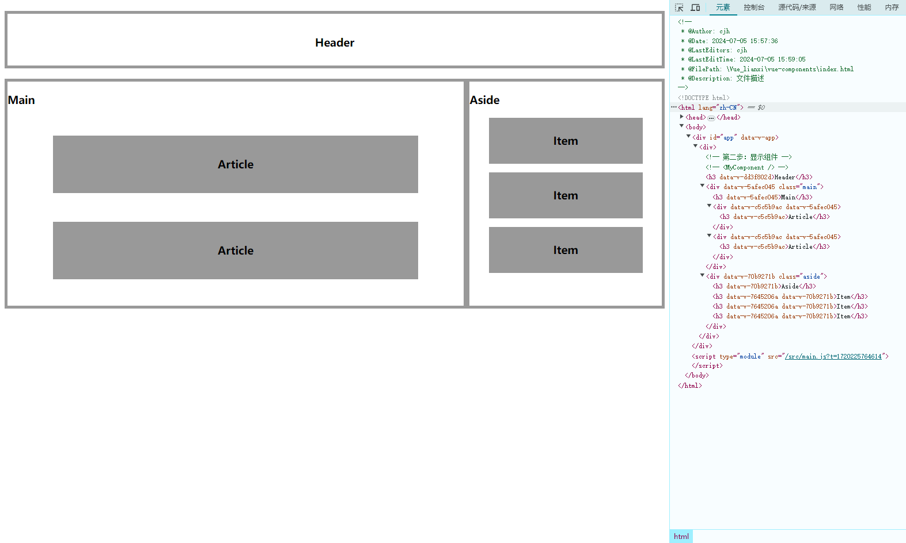

#### **创建vue项目**

在控制台或者终端输入

```nginx
cnpm init vue@latest
```

填写名称，一路回车 否，即可安装成功。

```bat
正在初始化项目 D:\ProjectFiles\Vue_lianxi\vue-test...

项目初始化完成，可执行以下命令：

  cd vue-test
  npm install
  npm run dev

PS D:\ProjectFiles\Vue_lianxi>
```

使用cd vue-test进入下一级目录

使用cnpm install安装项目依赖

使用npm run dev启动项目

地址显示为http://127.0.0.1:5173/


v-bind绑定js里msg的值

```vue
<div v-bind:class="msg" v-bind:id="msg">测试</div>
```

简写可去掉v-bind，需要有空格隔开 否则报错

```vue
<div :class="msg" :id="msg">测试</div>
```


#### **条件渲染**

v-if	v-show

```md
两者区别

`v-if` 是“真正”的条件渲染，因为它会确保在切换过程中，条件块内的事件监听器和子组件适当地被销毁和重建。
`v-if` 也是惰性的：如果在初始渲染时条件为假，则什么也不做——直到条件第一次变为真时，才会开始渲染条件块。
相比之下，`v-show` 就简单得多——不管初始条件是什么，元素总是会被渲染，并且只是简单地基于 CSS 进行切换。
一般来说，`v-if` 有更高的切换开销，而 `v-show` 有更高的初始渲染开销。因此，如果需要非常频繁地切换，则使用 `v-show` 较好；如果在运行时条件很少改变，则使用 `v-if` 较好
```

```
个人理解

v-if  用于条件判断，后面可以接v-else-if或v-else	实际上是js控制元素是否存在
v-show用于频繁切换，实际上是css的  style="display: none;"	控制显示与隐藏
```


#### **列表渲染**

v-for

遍历对象有三个值(value,key,index)

遍历数组有两个值(value,index)


#### **通过key管理状态**

```md
当 Vue 正在更新使用 `v-for` 渲染的元素列表时，它默认使用“就地更新”的策略。如果数据项的顺序被改变，Vue 将不会移动 DOM 元素来匹配数据项的顺序，而是就地更新每个元素，并且确保它们在每个索引位置正确渲染。

为了给 Vue 一个提示，以便它能跟踪每个节点的身份，从而重用和重新排序现有元素，你需要为每项提供一个唯一的 `key` attribute：
```

也就是需要一个唯一id来管理元素列表状态

不要使用index作为key，因为index作为列表的下标，如果非列表末添加元素，则会更改其他元素下标。


#### **事件处理**

> 内联事件处理器

```vue
<template>
  <div>
    <h3>内联事件处理器</h3>
    <button v-on:click="count++">功德加一</button>
    |
    <button v-on:click="count--">功德减一</button>
    <p>功德：{{ count }}</p>
  </div>
</template>

<script>
export default {
  data() {
    return {
      count: 0,
    };
  },
};
</script>
```

> 方法事件处理器

```vue
<template>
  <div>
    <h3>方法事件处理器</h3>
    <button @click="addCount">功德加一</button>
    <p>功德：{{ count }}</p>
  </div>
</template>

<script>
export default {
  data() {
    return {
      count: 0,
    };
  },
  methods: {
    addCount() {
      this.count++;
      console.log("点击了" + this.count + "次");
    },
  },
};
</script>
```

#### 获取event对象

方法入参若为空，则可直接调用event

方法入参如果有值，则需要在template里加上入参$event方可调用

#### **传递参数**

```vue
<p @click="clickFive(item)" v-for="(item, index) in names" :key="index">
      {{ item }}
</p>
```


#### **事件修饰符**


```vue
<a @click.prevent="demo" href="https://www.sogou.com/">搜狗</a>
```

```vue
<a @click.prevent="stop" href="https://www.sogou.com/">搜狗</a>
```

prevent可阻止阻止事件的默认行为（页面单击跳转），stop可阻止事件冒泡（阻止事件继续向父元素传播）。

```md
说明：
修饰符'.prevent'用于阻止事件的默认行为。例如，阻止表单提交或者超链接的跳转。
修饰符'.stop'用于阻止事件的进一步传播，即阻止事件冒泡到父元素。
修饰符'.once'用于只触发一次事件监听器。即使在事件发生后，它也会自动删除监听器。
修饰符'.enter'通常用于处理键盘事件，特别是keydown或keyup事件，它指定了按下回车键时触发的行为。
```


#### **数组变化侦测**

变更方法

```vue
push()
pop()
shift()
unshift()
splice()
sort()
reverse()
```

不可变方法

```
filter()
slice()
concat()
```

使用不可变方法时  需注意使用this.demo1=this.demo1.concat(this.demo2);

```js
methods: {
    addListHandle() {
      this.names.push("Marry", "June");
      this.names = this.names.concat(["AAA", "BBB"]);
    },
    addList() {
      //   this.nums1.push(nums2);
      //   this.nums1.push(...this.nums2);
      this.nums1 = this.nums1.concat(this.nums2);
    },
  }
```

官方文档：[点击跳转](https://cn.vuejs.org/guide/essentials/class-and-style.html#binding-html-classes)

#### **计算属性**

相较于methods的函数或方法，不用加括号，不会多次调用，节省性能。

（官方：不同之处在于**计算属性值会基于其响应式依赖被缓存**。一个计算属性仅会在其响应式依赖更新时才重新计算。）

```vue
<p>{{ personHobby }}</p>
<span>{{ obj }}</span>
```

```js
methods: {
    addObject() {
      this.objects = this.objects.concat("any");
    },
    subtract() {
      this.objects = [];
    },
  }
```


#### **class绑定**

官方解释：

数据绑定的一个常见需求场景是操纵元素的 CSS class 列表和内联样式。因为 `class` 和 `style` 都是 attribute，我们可以和其他 attribute 一样使用 `v-bind` 将它们和动态的字符串绑定。但是，在处理比较复杂的绑定时，通过拼接生成字符串是麻烦且易出错的。因此，Vue 专门为 `class` 和 `style` 的 `v-bind` 用法提供了特殊的功能增强。除了字符串外，表达式的值也可以是对象或数组。

官方文档：[绑定 HTML class](https://cn.vuejs.org/guide/essentials/class-and-style.html#binding-inline-styles)

代码详见：

```vue
<template>
  <div>
    <!-- 绑定对象 -->
    <p :class="{ active: isActive, danger: hasError }">Class样式绑定1-绑定对象</p>
    <!-- 多个对象绑定 -->
    <p :class="classObject">Class样式绑定2-多个对象绑定</p>
    <!-- 绑定数组 -->
    <p :class="[arrActive, arrDanger]">Class样式绑定3-绑定数组</p>
    <!-- 绑定数组-三元运算符 -->
    <p :class="[isPink ? 'pink' : 'orange']">Class样式绑定4-绑定数组-三元运算符</p>
    <!-- 绑定数组和对象 -->
    <p :class="[arrActive, isPink ? 'orange' : 'pink']">Class样式绑定5-绑定数组和对象</p>
  </div>
</template>

<script>
export default {
  data() {
    return {
      isActive: true,
      hasError: true,
      isPink: true,
      classObject: {
        active: true,
        danger: true,
      },
      arrActive: "active",
      arrDanger: "danger",
    };
  },
};
</script>

<style>
.active {
  font-size: 40px;
}
.danger {
  color: red;
}
.pink {
  color: pink;
}
.orange {
  color: orange;
}
</style>
```

绑定数组和对象时，只能数组包含对象。

#### style绑定

与class绑定很类似

官方文档：[绑定内联样式](https://cn.vuejs.org/guide/essentials/class-and-style.html#binding-inline-styles)

代码详见：

```vue
<template>
  <div>
    <h3>Style绑定</h3>
    <!-- 直接绑定样式 -->
    <p :style="{ color: 'red', fontSize: '20px' }">直接绑定样式</p>
    <!-- 动态绑定样式 -->
    <p :style="{ color: colorGreen, fontSize: fontSize + 'px' }">动态绑定样式</p>
    <!-- 多个对象绑定样式 -->
    <p :style="styleObject">多个对象绑定样式</p>
    <!-- 数组绑定样式 -->
    <p :style="[styleObject, styleRight]">数组绑定样式</p>
  </div>
</template>

<script>
export default {
  data() {
    return {
      colorGreen: "green",
      fontSize: "30",
      styleObject: {
        color: "orange",
        fontSize: "16px",
      },
      styleRight: {
        float: "right",
      },
    };
  },
};
</script>
```

#### 侦听器

与data(),methods,computed 并列，名称为watch

用法：

```js
watch: {
    //'demo'为前面{{}}里的变量名称，newValue表示变化后的值，oldValue表示变化前的值。
	demo(newValue, oldValue){
        //业务逻辑
    }
}
```

代码详见：

```vue
<template>
  <div>
    <h3>侦听器</h3>
    <p>{{ msg }}</p>
    <button @click="update">更新</button>
    |
    <button @click="del">清空</button>
    |
    <button @click="reset">重置</button>
  </div>
</template>

<script>
export default {
  data() {
    return {
      msg: "默认",
    };
  },
  methods: {
    update() {
      this.msg = "已更改";
    },
    del() {
      this.msg = "";
    },
    reset() {
      this.msg = "默认";
    },
  },
  watch: {
    msg(newValue, oldValue) {
      console.log("旧值是：" + oldValue, "新值是：" + newValue);
    },
  },
};
</script>
```

#### 表单输入绑定

用法详见官方文档：[表单输入绑定](https://cn.vuejs.org/guide/essentials/forms.html)

代码详见：

```vue
<template>
  <div>
    <h3>表单输入绑定</h3>
    <form>
      <!-- .number使用时，如果第一个字符非数字，则该修饰符无效 -->
      <input type="text" v-model.number.trim.lazy="msg" />
      <span>{{ msg }}</span>
      <br />
      <input type="checkbox" id="checkbox" v-model="checked" />
      <label for="checkbox">{{ checked }}</label>
    </form>
  </div>
</template>

<script>
export default {
  data() {
    return {
      msg: "",
      checked: false,
    };
  },
};
</script>
```


#### 表单输入绑定-修饰符

以下摘自官方文档：[表单输入绑定-修饰符](https://cn.vuejs.org/guide/essentials/forms.html#modifiers)

`.lazy`
默认情况下，v-model 会在每次 input 事件后更新数据 (IME 拼字阶段的状态例外)。你可以添加 lazy 修饰符来改为在每次 change 事件后更新数据：

```vue
<!-- 在 "change" 事件后同步更新而不是 "input" -->
<input v-model.lazy="msg" />
```


` .number`
如果你想让用户输入自动转换为数字，你可以在 v-model 后添加 .number 修饰符来管理输入：

```vue
<input v-model.number="age" />
```

如果该值无法被 parseFloat() 处理，那么将返回原始值。

number 修饰符会在输入框有 type="number" 时自动启用。


`.trim`
如果你想要默认自动去除用户输入内容中两端的空格，你可以在 v-model 后添加 .trim 修饰符：

```vue
<input v-model.number="age" />
```


#### 获取DOM操作

官方文档：[模板引用](https://cn.vuejs.org/guide/essentials/template-refs.html)

用法：

```vue
<template>
  <div ref="myElement">Hello</div>
</template>

this.$refs.myElement // 返回对应的 DOM 元素
```

使用ref属性可以获取对应的 DOM 元素

代码详见：

```vue
<template>
  <div>
    <h3>获取DOM操作</h3>
    <div class="container" ref="container">{{ content }}</div>
    <input type="text" ref="username" />
    <button @click="getElementHandle">获取元素</button>
  </div>
</template>

<script>
/**
 * 内容改变：{{ 模块指令 }}
 * 属性改变：v-bind: 指令
 * 事件:v-on(@):click
 *
 * 非必要不建议使用DOM
 */
export default {
  data() {
    return {
      content: "内容",
    };
  },
  methods: {
    getElementHandle() {
      this.$refs.container.innerHTML = "<hr/><a href='#'>你好</a>";
      console.log(this.$refs.username.value);
    },
  },
};
</script>
```


#### 组件组成

在App.vue里引入组件


---传统 Vue 2 单文件组件的写法

```vue
<template>
  <div>
    <!-- 第三步：显示组件 -->
    <MyComponent />
    <MyComponent />
  </div>
</template>

<script>
//第一步：引入控件
import MyComponent from "./components/MyComponent.vue";

export default {
  //第二步：注入组件
  components: {
    MyComponent,
  },
};
</script>

<style></style>
```


---Vue 3 `<script setup>` 语法的写法

```vue
<template>
  <div>
    <!-- 第二步：显示组件 -->
    <MyComponent />
    <MyComponent />
  </div>
</template>

<script setup>
//第一步：引入控件
import MyComponent from "./components/MyComponent.vue";
</script>

<style></style>
```


在 `<script setup>` 中，使用 `import` 语句导入组件。Vue 3 会自动将导入的组件注册为局部组件，无需再通过 `components` 选项注册。


#### 组件嵌套关系

Vue 实现了自己的组件模型，使我们可以在每个组件内封装自定义内容与逻辑。

官方文档：[组件基础](https://cn.vuejs.org/guide/essentials/component-basics.html)

官方示例：

如图呈现效果：



部分代码：

Main.vue

```vue
<template>
  <div class="main">
    <h3>Main</h3>
    <Article />
    <Article />
  </div>
</template>

<script>
import Article from "./Article.vue";

export default {
  components: {
    Article,
  },
};
</script>

<style scoped>
.main {
  float: left;
  width: 70%;
  height: 400px;
  border: 5px solid #999;
  box-sizing: border-box;
  /* border-top: 0px; */
}
</style>
```

Article.vue

```vue
<template>
  <div>
    <h3>Article</h3>
  </div>
</template>

<style scoped>
h3 {
  width: 80%;
  margin: 0 auto;
  text-align: center;
  line-height: 100px;
  box-sizing: border-box;
  margin-top: 50px;
  background: #999;
}
</style>
```


#### 组件注册方式

> 全局注册

全局注册后  可在组件中直接显示组件

```vue
<Header />
```

在main.js里注册

代码详见：

```js
// import './assets/main.css'
import { createApp } from 'vue';  // 从 Vue 中导入 createApp 函数
import App from './App.vue';     // 导入根组件 App.vue
import Header from './pages/Header.vue';  // 导入 Header 组件，路径可能需要根据实际情况调整

const app = createApp(App);     // 创建一个 Vue 应用实例，将 App 组件作为根组件

// 在这里注册 Header 组件，使其在整个应用中可用
app.component('Header', Header);

// 将应用挂载到具有 id="app" 的 DOM 元素上
app.mount('#app');
```


> 局部注册（推荐）

全局注册虽然很方便，但有以下几个问题：

1. 全局注册，但并没有被使用的组件无法在生产打包时被自动移除 (也叫“tree-shaking”)。如果你全局注册了一个组件，即使它并没有被实际使用，它仍然会出现在打包后的 JS 文件中。
2. 全局注册在大型项目中使项目的依赖关系变得不那么明确。在父组件中使用子组件时，不太容易定位子组件的实现。和使用过多的全局变量一样，这可能会影响应用长期的可维护性。

相比之下，局部注册的组件需要在使用它的父组件中显式导入，并且只能在该父组件中使用。它的优点是使组件之间的依赖关系更加明确，并且对 tree-shaking 更加友好。


在使用 `<script setup>` 的单文件组件中，导入的组件可以直接在模板中使用，无需注册：

```vue
<script setup>
import ComponentA from './ComponentA.vue'
</script>

<template>
  <ComponentA />
</template>
```

如果没有使用 `<script setup>`，则需要使用 `components` 选项来显式注册：

```js
import ComponentA from './ComponentA.js'

export default {
  components: {
    ComponentA
  },
  setup() {
    // ...
  }
}
```

局部注册需要使用 `components` 选项：

```vue
<script>
import ComponentA from './ComponentA.vue'

export default {
  components: {
    ComponentA
  }
}
</script>

<template>
  <ComponentA />
</template>
```

对于每个 `components` 对象里的属性，它们的 key 名就是注册的组件名，而值就是相应组件的实现。上面的例子中使用的是 ES2015 的缩写语法，等价于：

```js
export default {
  components: {
    ComponentA: ComponentA
  }
  // ...
}
```

请注意：**局部注册的组件在后代组件中<i>不</i>可用**。在这个例子中，`ComponentA` 注册后仅在当前组件可用，而在任何的子组件或更深层的子组件中都不可用。


#### 组件传递数据

官方文档：[Props](https://cn.vuejs.org/guide/components/props.html)

```js
//父级关键代码
<Child title="你好" :demo="demo" />

//子级关键代码
export default {
  props: ["title", "demo"],
};
```

完整代码示例：

父级：

```vue
<template>
  <div>
    <h3>Parent</h3>
    <Child title="你好" :demo="demo" />
  </div>
</template>

<script>
import Child from "./Child.vue";
export default {
  components: { Child },
  data() {
    return {
      demo: "apple",
    };
  },
  components: {
    Child,
  },
};
</script>
```

子级：

```vue
<template>
  <div>
    <h3>Child</h3>
    <p>{{ title }}</p>
    <p>{{ demo }}</p>
  </div>
</template>

<script>
export default {
  props: ["title", "demo"],
};
</script>
```

所有的 props 都遵循着**单向绑定**原则，props 因父组件的更新而变化，自然地将新的状态向下流往子组件，而不会逆向传递。这避免了子组件意外修改父组件的状态的情况，不然应用的数据流将很容易变得混乱而难以理解。


#### 组件传递多种数据类型


以对象类型传递为例：

父级：

```vue
<template>
  <div>
    <h3>Parent</h3>
    <!-- <Child title="你好" :demo="demo" /> -->
    <Child :sths="sths" />
  </div>
</template>

<script>
import Child from "./Child.vue";

export default {
  components: { Child },
  data() {
    return {
      demo: "apple",
      sths: {
        age: 30,
        name: "Leaves",
        names: ["a", "b", "c", "d"],
      },
    };
  },
};
</script>
```

子级：

```vue
<template>
  <div>
    <h3>Child</h3>
    <p>{{ title }}</p>
    <p>{{ demo }}</p>
    <p v-if="sths">{{ sths.name }}</p>
    <ul v-if="sths">
      <li v-for="(item, index) of sths.names" :key="index">
        {{ item }}+{{ sths.age + index }}
      </li>
    </ul>
  </div>
</template>

<script>
export default {
  props: {
    // 设置 title 必填且类型为字符串
    title: {
      type: String,
      default: "title",
      //   required: false,
    },
    // 设置 demo 类型为字符串，并设置默认值为 'default value'
    demo: {
      type: String,
      default: "pear",
    },
    // 设置 sths 类型为对象，并设置默认值为一个包含 age 和 names 的对象
    sths: {
      type: Object,
      default: function () {
        return {
          age: 18,
          names: [],
        };
      },
      required: true, // 设置 sths 必填
    },
  },
};
</script>
```

*（不过上面的sths里的ages好像默认值没使用成功，不传入ages时，设置了默认值，也会显示NaN）

- 所有 prop 默认都是可选的，除非声明了 `required: true`。
- 除 `Boolean` 外的未传递的可选 prop 将会有一个默认值 `undefined`。
- `Boolean` 类型的未传递 prop 将被转换为 `false`。这可以通过为它设置 `default` 来更改——例如：设置为 `default: undefined` 将与非布尔类型的 prop 的行为保持一致。
- 如果声明了 `default` 值，那么在 prop 的值被解析为 `undefined` 时，无论 prop 是未被传递还是显式指明的 `undefined`，都会改为 `default` 值。


#### 组件传递Props校验


> 必填项 (Required Props)

当我们希望某个 props 必须由父组件传递给子组件时，我们可以使用 `required` 属性来标记它。

```js
export default {
  props: {
    // 必须传递的 title 属性，类型为字符串
    title: {
      type: String,
      required: true
    }
  }
};
```

如果父组件没有传递 `title` 属性，Vue 将会在控制台发出警告，因为 `title` 是必须的。

> 默认值 (Default Props)

当父组件没有传递某个 props 时，我们可以为它设置一个默认值，以保证组件正常工作。

```js
export default {
  props: {
    // 类型为字符串，默认值为 'Default Title'
    title: {
      type: String,
      default: 'Default Title'
    }
  }
};
```

如果父组件没有传递 `title` 属性，那么 `title` 将默认为 `'Default Title'`。

> Props 不能修改

Vue 中的 props 默认是单向绑定的，这意味着子组件不能直接修改父组件传递的 props。这种设计有助于保持应用的可预测性和数据流的清晰性。

```js
export default {
  props: {
    // 类型为字符串的 title 属性
    title: String
  },
  methods: {
    updateTitle() {
      // 尝试修改 props 中的值会引发警告
      this.title = 'New Title'; // 这样做会引发警告
    }
  }
};
```

Vue 会在开发环境下对试图修改 props 的行为发出警告，以提醒开发者 props 应该是不可变的。如果子组件需要修改传递的数据，应当通过触发事件或者使用本地状态（data）来实现。


用法在 `组件传递多种数据类型` 已经使用到了。


#### 组件事件

在Vue中，子组件向父组件传递数据通常通过自定义事件实现。下面是一个基本的示例和一些注意事项：

> 子组件通过 `$emit` 触发事件

子组件模板中定义事件触发器：

```vue
<template>
  <button @click="handleClick">点击我</button>
</template>

<script>
export default {
  methods: {
    handleClick() {
      // 通过 $emit 发射自定义事件，并传递数据
      this.$emit('childEvent', '这是子组件传递给父组件的数据');
    }
  }
}
</script>
```

在上面的例子中，`handleClick` 方法通过 `$emit` 方法触发了一个名为 `childEvent` 的自定义事件，并传递了字符串 `这是子组件传递给父组件的数据` 。

父组件监听子组件的自定义事件：

```vue
<template>
  <div>
    <Child @childEvent="handleChildEvent" />
  </div>
</template>

<script>
import Child from './Child.vue';

export default {
  components: {
    Child
  },
  methods: {
    handleChildEvent(data) {
      // 处理子组件传递过来的数据
      console.log('接收到子组件传递的数据：', data);
    }
  }
}
</script>
```

在这个例子中，`<Child @childEvent="handleChildEvent" />` 表示监听 `<Child>` 组件触发的 `childEvent` 自定义事件，并将事件触发时传递的数据 `data` 作为参数传递给 `handleChildEvent` 方法处理。

**注意事项**

事件名命名：自定义事件名应该有意义和表达清楚其用途，避免与 DOM 原生事件或 Vue 内部事件名冲突。

数据传递：通过 `$emit` 传递的数据可以是任意类型（对象、数组、基本数据类型等）。

监听方法：父组件中监听子组件的自定义事件时，方法名要与模板中的事件处理方法名一致。

数据流：Vue 中数据是单向流动的，子组件通过事件向上传递数据给父组件，父组件不能直接修改子组件的数据，通常通过 `props` 和 `$emit` 来实现组件间的通信。

以上是关于 Vue 中子组件向父组件传递数据的基本实现方法及注意事项的总结。

——by chatGPT


#### 组件事件配合v-model使用

官方文档：[组件 v-model](https://cn.vuejs.org/guide/components/v-model.html)

这段代码实现了在 Vue.js 中，通过组件事件和 `v-model` 的结合使用，实现了父子组件之间的双向数据绑定和实时数据传递功能。

Main.vue：

```vue
<template>
  <div>
    <h3>Main</h3>
    <div>{{ search }}</div>
    <searchComponent @searchEvent="getSearch" />
  </div>
</template>

<script>
import SearchComponent from "./SearchComponent.vue";
export default {
  components: { SearchComponent },
  data() {
    return {
      search: "",
    };
  },
  methods: {
    getSearch(data) {
      this.search = data;
    },
  },
};
</script>
```

SearchComponent.vue：

```vue
<template>
  <div>搜索：<input type="text" v-model="search" /></div>
</template>

<script>
export default {
  data() {
    return {
      search: "",
    };
  },
  watch: {
    search(newValue, oldValue) {
      this.$emit("searchEvent", newValue);
    },
  },
};
</script>
```


#### 组件数据传递

*此节开始理解有点吃力


父组件：

```vue
<template>
  <div>
    <ComponentB :onEvent="dataFn" />
    <h3>父组件 {{ msg }}</h3>
  </div>
</template>

<script>
import ComponentB from "./ComponentB.vue";

export default {
  components: { ComponentB },
  data() {
    return {
      msg: "", // 初始化一个空的msg，用于接收子组件传递的数据
    };
  },
  methods: {
    // 定义一个方法，用于接收子组件传递的数据，并将其赋值给msg
    dataFn(data) {
      this.msg = data;
    },
  },
};
</script>
```

使用 ComponentB 组件，并通过 :onEvent 属性将父组件的 dataFn 方法传递给子组件。
当子组件触发 onEvent 方法时，父组件的 dataFn 方法将被调用，并传入子组件传递的数据 data，然后将其赋值给 msg。


子组件：

```vue
<template>
  <div>
    <h3>子组件 ComponentB</h3>
    <p>hello {{ onEvent("apple") }}</p>
  </div>
</template>

<script>
export default {
  props: {
    // 声明一个名为 onEvent 的 prop，类型为 Function，用于接收父组件传递的方法
    onEvent: {
      type: Function,
    },
  },
};
</script>
```

接收来自父组件的 `onEvent` 方法作为一个 prop，并在子组件内部调用它。

在 `<p>` 标签中，展示了调用 `onEvent` 方法，并传入了参数 `"apple"`。


原理解释：
父组件传递方法给子组件：
父组件通过 :onEvent="dataFn" 将自己的 dataFn 方法传递给子组件 ComponentB。
子组件调用父组件的方法：
子组件内部通过 onEvent("apple") 调用了父组件传递的 dataFn 方法，并传递了参数 "apple"。
数据流向：
子组件调用 onEvent("apple") 触发了父组件的 dataFn("apple") 方法，将 "apple" 赋值给了父组件的 msg，从而实现了从子组件到父组件的数据传递。


#### 透传 Attributes

（实际用的少，仅做了解）

“透传 attribute”指的是传递给一个组件，却没有被该组件声明为 [props](https://cn.vuejs.org/guide/components/props.html) 或 [emits](https://cn.vuejs.org/guide/components/events.html#defining-custom-events) 的 attribute 或者 `v-on` 事件监听器。最常见的例子就是 `class`、`style` 和 `id`。

当一个组件以单个元素为根作渲染时，透传的 attribute 会自动被添加到根元素上。举例来说，假如我们有一个 `<MyButton>` 组件，它的模板长这样：

template

```vue
<!-- <MyButton> 的模板 -->
<button>Click Me</button>
```

一个父组件使用了这个组件，并且传入了 `class`：

template

```vue
<MyButton class="large" />
```

最后渲染出的 DOM 结果是：

html

```vue
<button class="large">Click Me</button>
```

这里，`<MyButton>` 并没有将 `class` 声明为一个它所接受的 prop，所以 `class` 被视作透传 attribute，自动透传到了 `<MyButton>` 的根元素上。

> **禁用 Attributes 继承**

```js
export default {
  inheritAttrs: false
};
```


#### 插槽 Slots

官方文档：[插槽 Slots](https://cn.vuejs.org/guide/components/slots.html)

外站介绍：[vue插槽之插槽的用法及作用域插槽详解](https://blog.csdn.net/zxdznyy/article/details/128819330)

*插槽基本使用会了，但是具体排列顺序还有疑问

代码详见：

`App.vue` 

```vue
<template>
  <div>
    <!-- 插槽1 -->
    <SlotsBase>
      <div>
        <h3>插槽标题-父组件</h3>
        <p>插槽内容-父组件</p>
      </div>
    </SlotsBase>
    <!-- 插槽2 -->
    <SlotsTwo>
      <h3>{{ msg }}</h3>
      <template #main>
        <button>开始</button>
      </template>
      <template>
        <h3>你好</h3>
      </template>
    </SlotsTwo>
    <!-- 插槽3 -->
    <SlotsThree>
      <template v-slot:aaa="slotProps">
        <p>第三: {{ slotProps.msg }}-1</p>
      </template>

      <template v-slot:three="slotProps">
        <button>hhh{{ slotProps.msg }}-3</button>
        <p>第三-副本: {{ slotProps.msg }}-4</p>
        <button>显示-5</button>
      </template>
    </SlotsThree>
  </div>
</template>
<script>
import SlotsBase from "./components/SlotsBase.vue";
import SlotsTwo from "./components/SlotsTwo.vue";
import SlotsThree from "./components/SlotsThree.vue";

export default {
  data() {
    return {
      msg: "我是续集",
    };
  },
  components: {
    SlotsBase,
    SlotsTwo,
    SlotsThree,
  },
};
</script>
```

`SlotsThree.vue` 

```vue
<template>
  <div>
    <h3>then-2</h3>
    <slot name="three" :msg="msg">
      <i>none</i>
    </slot>
    <br id="5.5" />
    <i>abcde-6</i>
    <slot name="aaa" :msg="msg"></slot>
  </div>
</template>

<script>
export default {
  data() {
    return {
      msg: "Hello",
    };
  },
};
</script>
```


>插槽基础用法


>插槽渲染动态数据


>插槽默认值

父组件中：`v-slot:"example"`可以省略为`:example` 

子组件中：需要用`name="example"` 来绑定

> 默认插槽传递数据

父传子，子再传父


>具名插槽传递数据


#### 生命周期钩子


> 通过`ref`获取元素DOM结构

#### 生命周期应用


#### 动态组件

#### 组件保持存活

#### 异步组件

#### 依赖注入

#### Vue应用


